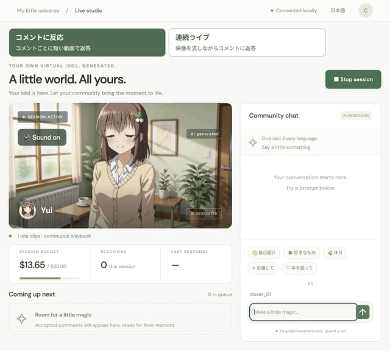

<div align="center">

# AI OshiBloom

### 推しの初配信を、あなたがつくる。

キャラクターをつくって、コメントを送る。返ってくるのは、その場で生成される声と動き。

**[音声付きで見る](docs/media/comment-reaction.mp4) · [最初のリアクションをつくる](#はじめる) · [English](README.md)**

オープンソースのAI VTuberスタジオ · Live2Dのリギング不要 · MITコード

</div>

[](docs/media/comment-reaction.mp4)

*音声オンで見てください。実際のアプリでの検証映像です。生成の待ち時間は早送りしていません。GIFをクリックすると音声付き動画を開けます。[録画方法と素材について](docs/ASSETS.md#readme-demonstration-media)。*

**もし自分の推しが初配信を始めたら、最初に何を聞きますか？**

「自己紹介して」「お休みの日は何してる？」「明日の発表が不安。応援して」

AI OshiBloomは、あなたのキャラクターに、コメントに応える舞台をつくるアプリです。見た目と性格を決めたら、ひとこと送ってみてください。そのコメントに応じた声と動きを生成します。「連続ライブ」では、流れ続ける映像にコメントで次の展開を伝えられます。

自分のAI VTuberをつくりたいクリエイターと、視聴者が参加する生成動画を開発したい人へ。

**開発初期のプレビューです。** スタジオのコードはオープンソース。本物の生成には**有料のfal API**を使用します。モデルの重みやクラウド生成枠は含まれません。画面操作はキーなしでも試せます。

## あなたのキャラに、あなたのコメントで、次のシーンを。

- **自分だけの初配信をつくる。** 外見、部屋、人格、声の説明をローカルのスタジオで設定。この生成方式では、Live2Dのリギングやモーションキャプチャーは不要です。
- **ひとことが、声と動きになる。** 質問や「手を振って」というお願いから、音声と動画を一緒に生成します。
- **配信のテンポを選ぶ。** コメントごとに短い反応をつくる「コメントに反応」と、映像を流しながら応答する「連続ライブ」を切り替えられます。
- **自分のつくりたい配信へ。** キャラ設定はフォルダーで持ち運べます。人格の調整、生成接続の改造、コメント反応のOBS表示にも進めます。

## 初配信、5つのコメントから。

生成を接続したら、画面にある5つの質問を試してみてください。

1. **「自己紹介して」** — まずは、推しの第一声。
2. **「好きな飲み物は？」** — 小さな好みを聞いてみる。
3. **「お休みの日は何してる？」** — そのキャラの日常へ。
4. **「明日の発表が不安。応援して」** — 自分に向けたひとことを。
5. **「笑顔で手を振って」** — 声と動きで、ごあいさつ。

**あなたのキャラは、なんて答えましたか？** 質問が見える短い音声付き動画で、初配信のひとコマを共有してください。使用モードと編集の有無も添えると、ほかの人が試しやすくなります。予想外の返答も、改善の手がかりになります。

## はじめる

**Node.js 22以上**を用意します。このリポジトリをダウンロードまたはcloneし、そのフォルダーで実行してください。

```sh
npm ci
npm run build
npm start
```

**[localhost:8790](http://127.0.0.1:8790)**を開き、右上の「日本語」で表示を切り替えます。セッションを開始し、質問例を選んで送信してください。

初期設定の無料デモはAPIキー不要です。サンプル静止画と定型の返事で、画面操作を試せます。**新しい動画や音声を生成するには、プロバイダーの接続が必要です。**

### 声と動きのある反応をつくる

1. `.env.example`を`.env`としてコピーし、`FAL_KEY`を設定して再起動します。
2. 「配信設定」で動画・返事のプロバイダーにそれぞれ「fal」を選んで保存します。
3. 「わたしの推し」でキャラクターを作成し、顔・全身・場面の3枚を生成して確認します。待機動画はまず**1本**から試してください。
4. 上部の「コメントに反応」を選び、セッションと音声をオンにしてコメントを送ります。

待機動画と反応動画の構図を揃えるために**FFmpeg**も必要です。PATHにない場合は`FFMPEG_BINARY`を設定してください。APIキーはサーバー側で扱います。生成時にはプロンプトや参照画像をプロバイダーへ送信します。

間隔調整や音声設定は[セットアップガイド](docs/SETUP.md)にまとめています。

## 配信スタイルを選ぶ

### コメントに反応

コメントごとに返事と短い動画を生成します。合間は待機動画を再生し、返答テキストは映像が始まってから、小さな字幕とチャットに表示します。

切り替えボタンで選ぶと**H3 Max Turbo**を使用します。キュー、承認、視聴者ごとの待ち時間、費用見積もり、OBS表示に対応。YouTube Liveのコメント取得もこのモードで利用できます。最初は手動コメントから試すのがおすすめです。

### 連続ライブ

1つの映像・音声ストリームを流しながら、コメントで次の展開を変えます。**H3 Max Director**を使い、接続中は同じ参照画像と声の説明を維持します。

現在は**手動コメント**と音声付き録画に対応する実験機能です。コメント反応モードのキュー、YouTube接続、費用メーター、OBSオーバーレイとは別に動きます。実測時にプロバイダーから通知された接続上限は**120秒**でした。

## いま試せるところまで、実演しています

両モードで、日本語の5種類の質問に対する映像・音声の実生成を確認しました。Directorの1回の試験では、文字起こしの時刻から推定した回答開始は送信後**約5〜8秒**でした。小規模な実測であり、速度を保証する数値ではありません。

以下は改善中です。

- **回答後の余分な発話。** 無言待機の指示だけでは抑え切れていません。
- **声の固定。** seedや説明文は保存しますが、声質の一致は保証できません。DirectorとTurboでは保存済みの参照音声を使いません。
- **返事の長さ。** 動画の尺に収まらない返事が生成される場合があります。
- **長時間の配信。** 接続上限、再接続、動きが少なくなる区間への対応が必要です。

まずは短時間の試験から始めてください。クラウド生成は有料です。コメント反応モードの費用は見積もりであり、**Directorの料金はそのメーターに含まれません**。

## 次の配信のかたちを、一緒につくる

目指しているのは、見ている人の言葉で育っていくキャラクターの配信です。最初の挨拶が会話になり、視聴者のアイデアが次のシーンになる。その入口を、誰もがつくれるようにしたい。

現在のプレビューでは、コメントへのリアクションと短時間の連続ライブを試せます。**次に取り組みたいのは以下です。実装済みの機能や、期限付きの提供約束ではありません。**

- **聞けば、その子だとわかる声へ。** 質問やセッションをまたぐ声の一貫性を評価する。
- **返事が終わったら、次の言葉を待てるように。** 余分な発話を抑え、会話の間を整える。
- **配信を、もっと長く。** 接続の更新と復帰を改善する。
- **最初の「話してくれた！」までを短く。** 初回設定と実生成までの手順を減らす。

キャラをつくって試す、再現できる録画を共有する、コードを改善する。どの参加も歓迎です。**気になったらStarで保存。更新を受け取りたい方はWatch → Custom → Releasesを選んでください。**

不具合報告には、使用モード、ブラウザー、再現手順、可能なら短い録画を添えてください。ログからAPIキーや個人情報を取り除いてください。

```sh
npm test
npm run build
```

現在の18件のテストは、キュー、中止処理、費用確保、再生開始通知、プロバイダーへの入力、HTTP/WebSocketを検証します。生成品質は実際の動画で別途確認しています。

`src/`がサーバーと生成接続、`public/`がスタジオとオーバーレイ、`client/`が連続ライブの実装です。独自のローカル生成をつなぎたい場合は、実験的な[ComfyUI接続](local/README.md)を参照してください。

## ライセンス

コードは**[MIT](LICENSE)**です。モデルサービスや生成メディアには別の条件が適用されます。[素材の出典](docs/ASSETS.md)も確認してください。利用するキャラクター・参照素材の権利は各自で確認してください。画面にはAI生成の表示が入ります。

## 貢献

Issue と PR を歓迎します。[CONTRIBUTING.md](CONTRIBUTING.md) を参照。レビューも PR と同じだけ歓迎で、誰でもできます。
